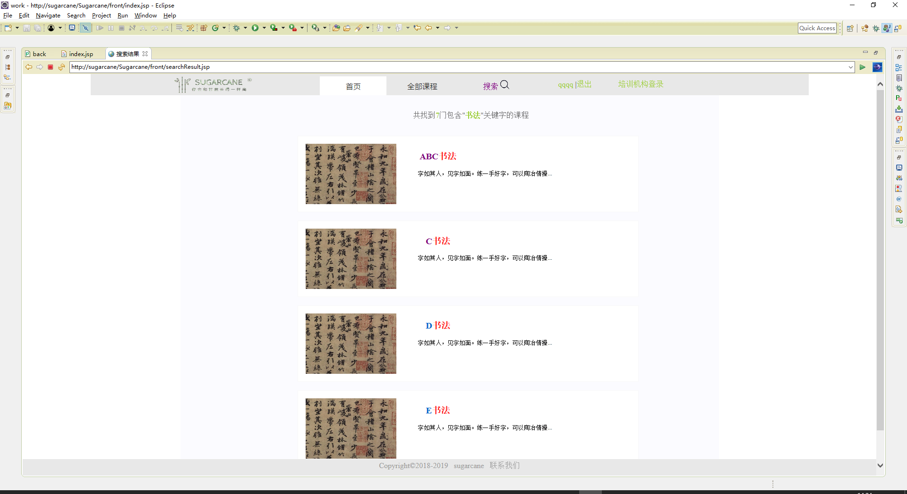

# Sugarcane线下课程推荐网站

* [Github](https://github.com/WuTung/sugarcane.git) 
* [Redmine](http://10.7.1.5/projects/bigdata_sugarcane/files)

## 项目简介

**Sugarcane线下课程推荐网站**--一个个性化推荐平台，可以根据用户在线操作的数据，给用户推荐出他们可能感兴趣的课程。可以大大提高用户的查找课程的效率，提高培训机构知名度。是一个可以令推荐平台更加人性化的推荐系统。

## 使用说明

* 将项目部署在Tomcat服务器后，导入sql文件建立数据库，打开浏览器
* 普通用户首页：http://sugarance/Sugarance/front/index.jsp

## 完成功能

> 普通用户：

>> 用户登录注册、密码加密

>> 运用了lucene的搜索功能

>> 运用了推荐算法的猜你喜欢

>> 用户收藏功能

>> 完善和修改个人信息功能

>> 评论功能

>> 邮箱验证功能

> 培训机构：

>> 注册登录、密码加密

>> 邮箱验证

>> 培训机构对于培训机构简介的管理

>> 培训机构对于课程和课程分类的管理

> 管理员：

>> 管理员对于用户和培训机构的禁用管理

## 项目成员

> 吴桐（项目组长)
  
>> Email:qwtt160424@163.com

>> github:https://github.com/WuTung
  
> 秦晓宇(开发人员/技术支持)
  
>> Email：jobulence@163.com

>> github:https://github.com/qxxxxxxxxxxy

> 王孜润（设计人员/开发人员）
  
>> Email:1010870945@qq.com

>> github:https://github.com/MeccaMe
  
> 杜凯玲（开发人员）
  
>> Email:1052964148@qq.com

>> github:https://github.com/dukailing

> 张梦洲（开发人员）
  
>> Email：1421135093@qq.com

>> github:https://github.com/zhangmengzhou
  
> 王晟宇（开发人员）
  
>> Email:852701882@qq.com

>> github:https://github.com/2015015279

> 崔允松（开发人员）
  
>> Email:337579873@qq.com

>> github:https://github.com/cui337579
  
> 冯海晴（开发人员）
  
>> Emali:15732103382@163.com

>> github:https://github.com/haiqingfeng
  
> 冀晋文（测试人员）
  
>> Email:1497277185@qq.com

>> github:https://github.com/ytdyyyaa
  

## 运行效果

> 首页
  
>> 

> 完善个人信息页面
  
>> 

> 添加课程页面
  
>> 

> 搜索页面
  
>> 

> 重置密码页面
  
>> 

> 收藏页面
  
>> 

> 全部课程页面
  
>> 

> 课程详情页面
  
>> 

> 培训机构登录页面
  
>> 

> 管理课程页面
  
>> 

> 个人信息页面
  
>> 

> 绑定邮箱找回密码页面
  
>> 
