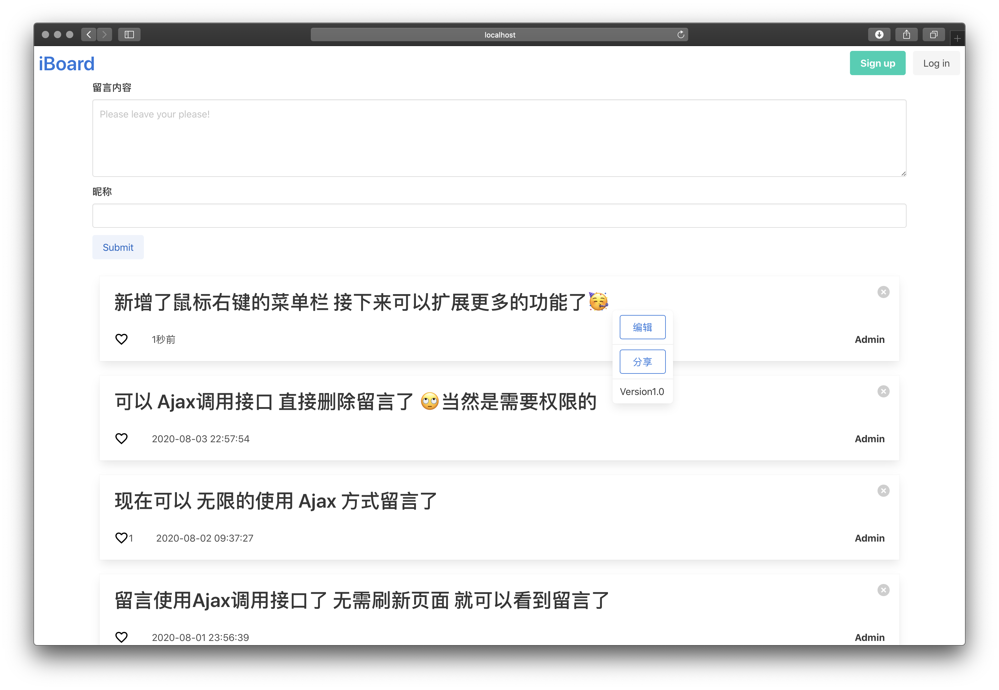
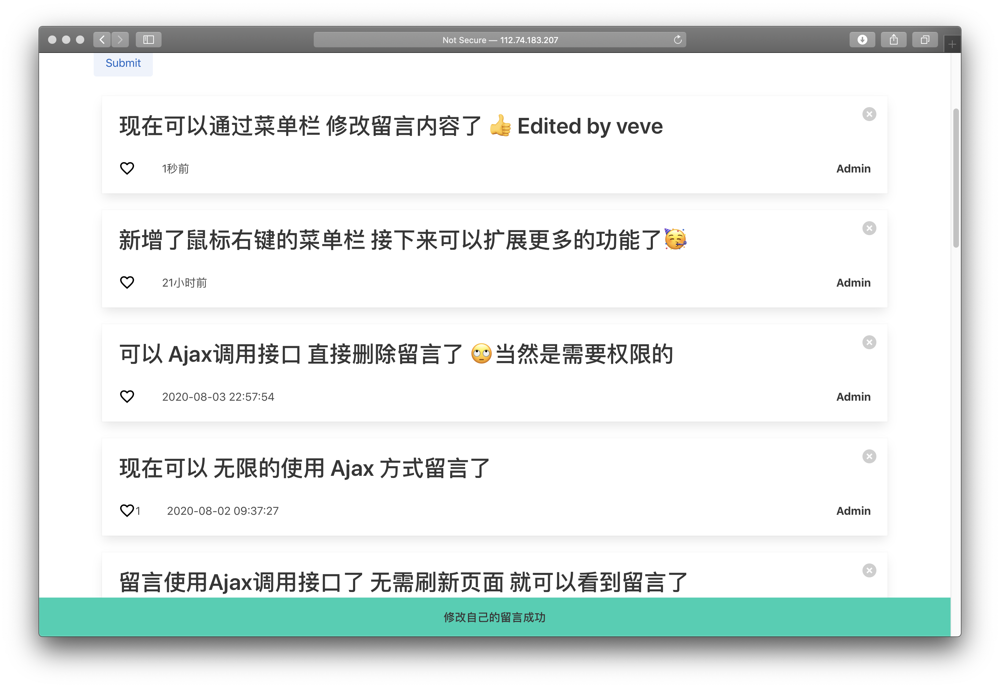

# iBoard

基于 SSM 框架的留言板 功能非常简单 但在持续更新完善中<br>
iBoard是在学习了SSM框架课程的结课作业(已经结课)

Demo
+ http://veveup.com:81/iboard/message/getAll
+ http://112.74.183.207:81/iboard/message/getAll <br>
因为服务器内存有限 再运行一个MySql Server后内存不足 所以更换成Sqlite

前端：Html+Bulma.io<br>
框架：Spring SpringMVC MyBatis<br>
支持数据库：Sqlite/Mysql<br>
测试服务器：Tomcat9.0.4<br>






# To-do
 - [x] 用户系统
    - [ ] 安全优化
    - [x] 权限管理
 - [x] 留言修改和删除
    - [x] 删除
    - [x] 修改
    - [x] Ajax发送留言
    - [x] Ajax删除留言
 - [ ] 点赞 评论系统
    - [x] 点赞
    - [ ] 评论
 - [ ] 视图
    - [x] Toast提醒
    - [x] contextMenu
 
 
 # QA
 1. 数据库安装正确 密码账号无误的情况下出现数据库连接问题可能的解决方法：<br>
 找了一下资料可能是客户端不支持新的密码加密方法 导致无法连连接
 ```mysql
use mysql;
ALTER USER 'root'@'localhost' IDENTIFIED WITH mysql_native_password BY 'new_password';
flush priviliges;
```


# Log
+ **2020.08.06** AjaxEdit 具体实现方法 视图更新 鉴权
+ **2020.08.05** AjaxEdit 视图/接口 增加了鼠标右键留言的功能菜单 具体功能还未实现
+ **2020.08.03** AjaxDelete 视图/JS方法 Toast底部弹出式提醒 用来显示可以Ajax请求的功能
+ **2020.08.02** AjaxSubmit 视图/JS方法更新 可以支持无限的请求并动态显示
+ **2020.08.01** 增加用户权限 部分功能验证是否有操作权限 通过Ajax调用留言接口 若成功则直接在当前页面新增一条留言 无需刷新 但该新增仅支持显示最后一次Ajax请求
+ **2020.07.30** 增加点赞视图 通过Ajax调用 点赞接口  修复移动设备登陆注销按钮隐藏
+ **2020.07.29** 增加留言删除方法 删除按钮
+ **2020.07.28** 仅仅新增用户系统 还没有合并入主要功能
+ **2020.07.27** 增加sqlite数据库支持 增加时间戳

# ISSUE
- [x] 浏览器缓存静态文件 js/css 文件不重新获取 可以在引用更改的静态文件后面添加随机参数 param=<%= Math.random()%>